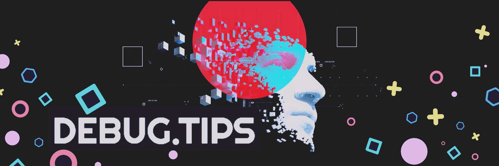

Infosec Luminary, here 👋

Humbled Cybersecurity professional, engaging as senior Malware Researcher, creative tinker and self-proclaimed ethical hacker specializing in reverse engineering. It is my mission to isolate new trends in Malscripts, Malware and Malvertising campaigns to eradicate pervasive persistence.

Want to know more about me? [Check out my portfolio.](https://debug.tips/)

## 📝 Latest Blog Posts
<!-- BLOG-POST-LIST:START -->
<!-- BLOG-POST-LIST:END -->

 

## 📌 Pinned Repositories

 

 

 

 
 

This content is intended to be consumed by cyber security professionals, ethical hackers, and penetration testers. This is meant to be a semi-exhaustive manual for malware research.  Any strategies performed should only be performed in environments that you control or have explicit permission to perform them on.

 

## &#x1f4c8; GitHub Stats

 

 
 

## 💼 Skills

More Skills

 

  

 

 

 

## 📣 How about a Debugging tip before you go?

> 
{debug_tips}

>
> 
{debugging_example}

_Tip sourced from [Google Dorks](https://www.programmablesearchengine.google.com/)_

Check back often for a new tip!

 

> ### Want to know the limited liability disclaimer?
>
> To the maximum extent permitted by applicable law, debug.tips and/or affiliates who have submitted content to debug.tips, shall not be liable for any indirect, incidental, special, consequential or punitive damages, or any loss of profits or revenue, whether incurred directly or indirectly, or any loss of data, use, goodwill, or other intangible losses, resulting from (i) access to this resource and/or inability to access this resource; (ii) any conduct or content of any third party referenced by this resource, including without limitation, any defamatory, offensive or illegal conduct or other users or third parties; (iii) any content obtained from this resource

Check out the [disclaimer](https://debug.tips/blog/killer-infosec-liability-disclaimer/)!
